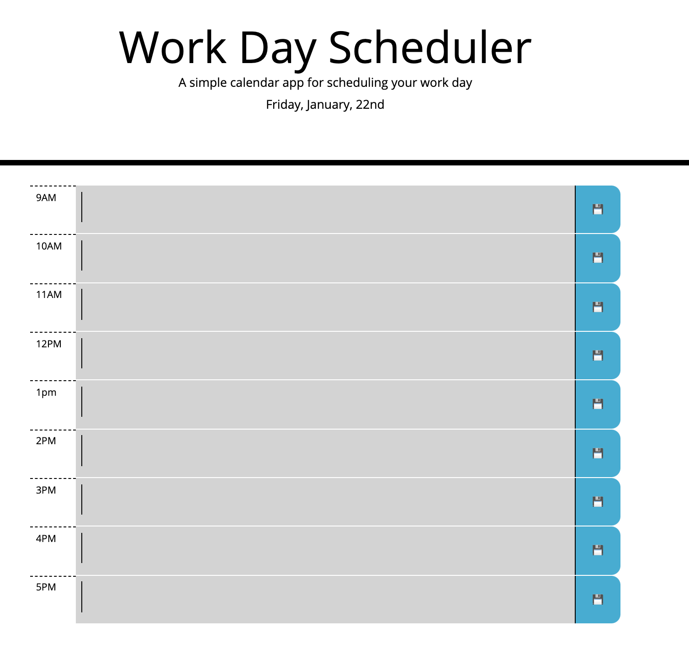
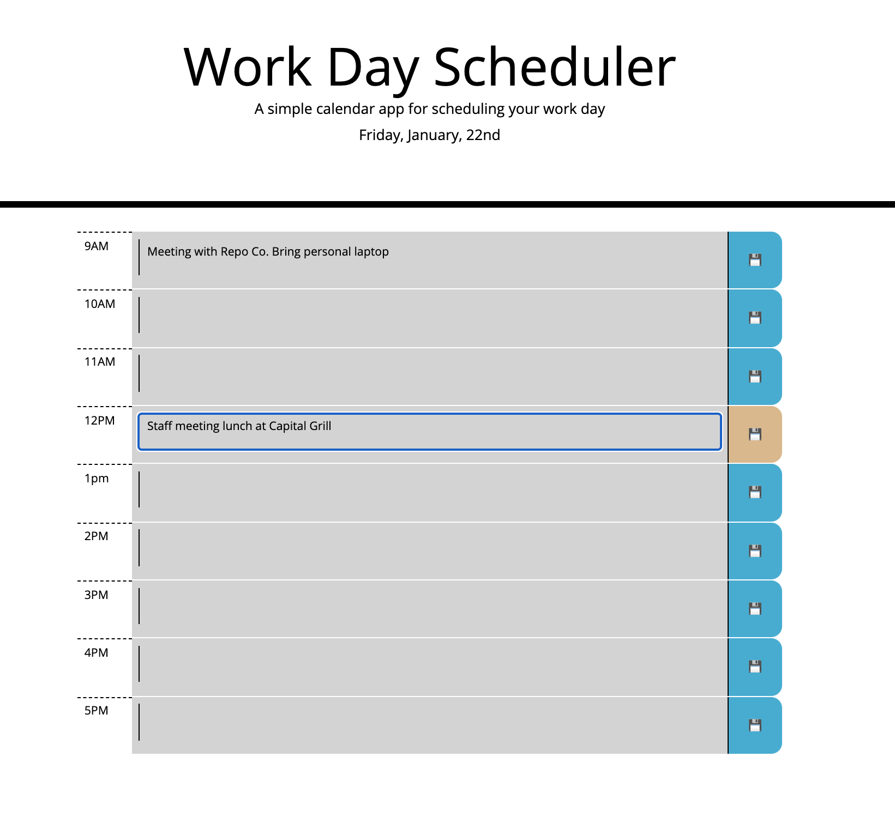

# Work Day Schedule

## Description

- I created this work day scheduler using a third-party library called Moment.js. This allows the time and date on the page to update automatically.
- The Day Scheduler is user-friendly and very helpful for busy users who wis. The header features the current date. Below, the page displays all the time blocks of one day in one page.
- The time blocks change in color depending on the time of day.
- The tasks which users input in the time blocks is stored in local storage and it repopulates after the browser is refreshed.

## Links

### Repo: 
https://github.com/crizk-crizk/Day-Scheduler

### Live Link
https://crizk-crizk.github.io/Day-Scheduler/

## Screenshots

